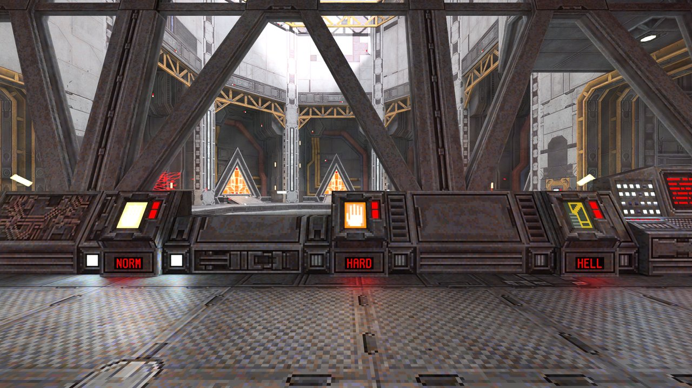
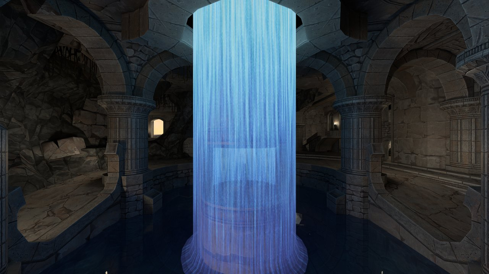
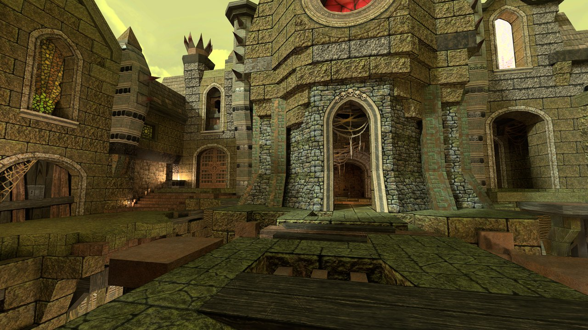
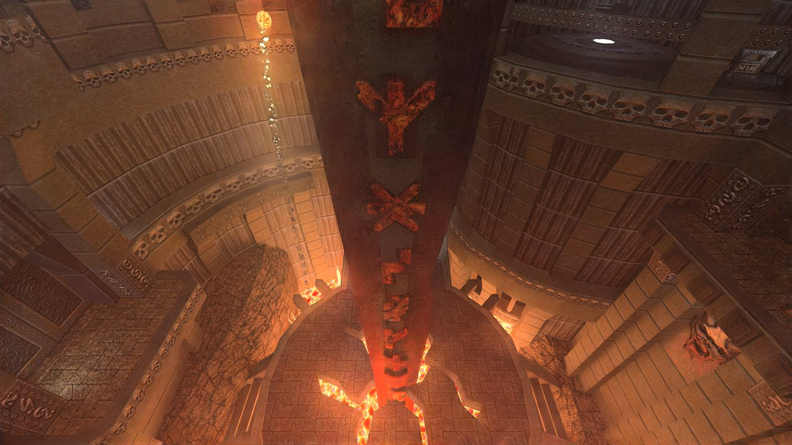

# merian-plugin-quake

Quake as a [merian](https://github.com/LDAP/merian) scene: [Quakespasm](https://github.com/LDAP/quakespasm)
runs the game, merian path traces it.

<p align="center">
  
  <br />
  <a href="images/demo.mp4">MP4</a>
</p>
<p align="center">
  
  
  
  
</p>

Credits: start from Alkaline; ad_tears, start, ad_sepulcher, ad_azad, ad_grendel from Arcane Dimensions; start from The Immortal Lock.

Note: Proper volume handling and transparency needs `--denoiser dlss` and a NVIDIA GPU currently.

## Build

The plugin is built as a merian subproject:

```bash
git clone --recursive https://github.com/LDAP/merian
cd merian
git clone --recursive https://github.com/LDAP/merian-plugin-quake subprojects/merian-plugin-quake
meson setup build --buildtype release
meson compile -C build
```

The plugin shares merian's build configuration, so pass `--buildtype` to merian, not to the plugin.
For `--denoiser dlss`, configure merian with `-Ddlss=enabled` (downloads the NVIDIA NGX SDK).

## Run

You need the Quake game data: a directory containing `id1/pak0.pak` and `id1/pak1.pak`, plus the
directories of any mods (e.g. `ad` for Arcane Dimensions, `alk` for Alkaline).

```bash
build/merian-graph-run subprojects/merian-plugin-quake/quake.json -basedir <quake dir> +map e1m1
build/merian-graph-run subprojects/merian-plugin-quake/quake.json --denoiser dlss -basedir <quake dir> -game ad +map ad_tears
```

On Windows, run it through `meson devenv -C build merian-graph-run ...` so the DLLs are found.
Everything after the graph that is not an option below is the Quake command line.

### Options

- `--renderer <pt|pt_mcpg|pt_ssmm|restir_di|restir_pt>`: the renderer (default `pt_mcpg`).
- `--denoiser <svgf|dlss>`: the denoiser (default `svgf`).
- `--volume <off|on>`: traces the fog.
- `--max-path-length <n>`, `--spp <n>`: path-traced renderers.
- `--quality <ultra_fast|fast|default|quality>`, only with `--denoiser dlss`:
    - `quality`: resampled next event estimation.
    - `fast`: traces at 3/4 resolution and lets DLSS upscale.
    - `ultra_fast`: traces at 1/2 resolution with 1 sample per pixel and 1 diffuse bounce, and ends
      paths in the irradiance cache (not available with `--renderer pt`).

  Options apply in command line order, so give `--quality` after `--renderer`.

`--help` after `quake.json` lists all options of the graph.
